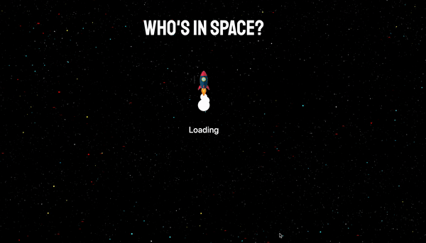
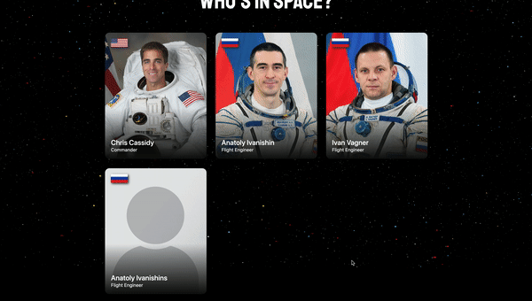

# Who's in Space?
[](https://travis-ci.org/ad13380/WIS-v1)
[](https://codeclimate.com/github/ad13380/WIS-v1/maintainability)
[](https://codeclimate.com/github/ad13380/WIS-v1/test_coverage)

*This project is still a work in progress, more features are being added*

As a long time space enthusiast, I've been engrossed in the recent [SpaceX Demo Crew launches](https://www.spacex.com/updates/crew-demo-2-mission-update-5-30-2020/). After curiously browsing the web to find out more about the astronauts currently in space, I found a lot of online resources were either sparse of information or involved clicking through lots of different sites (half of them being in Russian). There didn't seem to be a concise single page summary, so I thought I'd try to make one.

The purpose of this project is to create a simple one page application that uses several APIs to pull data about every astronaut currently in space, and to then present that data in a way that is clean and is easy to read. 

This app is written in JavaScript(ES6), HTML5 and CSS3 within an Express web framework. It uses a [Jest](https://jestjs.io/) testing framework, [Code Climate](https://codeclimate.com/) for code review and test coverage, and [Travis CI](https://travis-ci.org/)'s continuous integration service.

## Visit the Site
This app is deployed on Heroku, you can visit it [here](https://whosinspace.herokuapp.com/)

## Screen Previews
### Site Overview


### Loading Animation


### 404 Error Page


### Placeholder for Missing Data


### Viewing on a Mobile Device


## Features
### Implemented
- Provides an up to date list of:
  - The name of all astronauts in space
  - Their title (rank or position)
  - Their photo
  - Their nationality (as a flag thumbnail)
  - A brief description about them (displayed after clicking on their card)
  - The current spacecraft their in
  - Number of days in space for their current assignment
  - Number of career days
  - A link to a "Read More" page
- Placeholder images and descriptions in case data is not available for a given astronaut
- Responsive layout for different screen sizes and mobile devices
- Responsive parallax background that responds to cursor movements
- Loading animation while API data is being fetched
- 404 page for incorrect routes

## Challenges and Known Issues
- CORS error
  - I was initially unable to use the [How Many People are In Space API](https://www.howmanypeopleareinspacerightnow.com/peopleinspace.json) as every GET request resulted in a CORS error. After a lot of research I reasoned the easiest way to overcome the issue was to use a proxy server that would take the API data and add a ```Access-Control-Allow-Origin: *``` header to the response
  - I implemented an [open source proxy server](https://github.com/Rob--W/cors-anywhere) that seemed to solve the issue, but was quickly blocked by an API rate limit error
  - I then decided to deploy my own [dedicated proxy server](https://github.com/ad13380/cors-proxy-server). This seems to have solved the problem
- Slow load time
  - When first visiting the site, it can take a few seconds for the content to be loaded. This may be partly down to the time it takes for Heroku to spin up a server, but in large part it will be down to the time it takes to receive API data via a proxy
  - I'm unsure of how to speed this up, but a useful feature to include will be some type of loading animation to show that the page is still in fact loading and has not crashed
